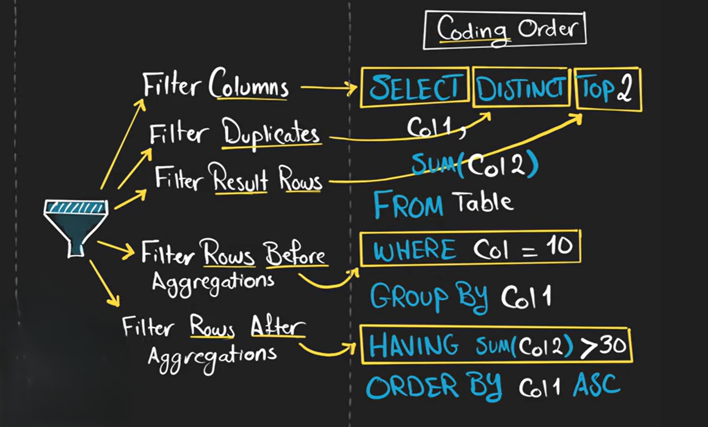
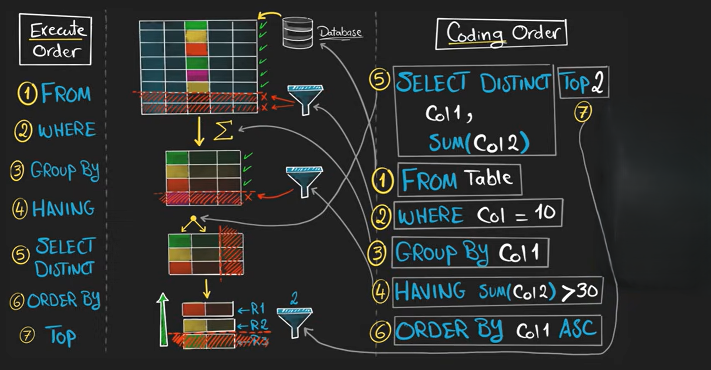

# execution order vs coding order

lets learn this uisng this example

```sql
SELECT DISTINCT TOP 2
    Col1,
    SUM(Col2)
FROM Table
WHERE Col = 10
GROUP BY Col1
HAVING SUM(Col2) > 30
ORDER BY Col1 ASC;
```


## **SQL Coding Order (What you write in the query)**




this is the order in which the query is written and expected to run by the programmer

---

## **SQL Execution Order (What the database actually does)**

1. **FROM Table** → read the table
2. **WHERE Col = 10** → filter rows based on conditions
3. **GROUP BY Col1** → group the filtered rows by `Col1`
4. **HAVING SUM(Col2) > 30** → filter the grouped rows
5. **SELECT DISTINCT SUM(Col2), Col1** → calculate the aggregated values, remove duplicates
6. **ORDER BY Col1 ASC** → sort the final result
7. **TOP 2** → limit the final sorted rows to the top 2



<br>

if we look aat this we can see that the coding order is completely different from the execution order 

so once we learn how sql execute query you can easily build correct queries

---


