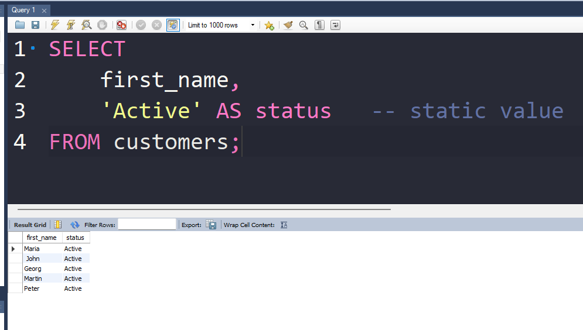

# **Static Values in SQL Queries**

**Static values** are values that you **hardcode directly inside your SQL query**.
They are **not taken from any table or column** — you write them yourself.

They stay **fixed** every time the query runs.

## **What Are Static Values?**

Static values are:

* Text you type → `'Hello'`, `'Active'`
* Numbers you type → `10`, `5000`
* Dates you type → `'2024-01-01'`
* Boolean values → `TRUE`, `FALSE`
* NULL → `NULL`

They are simply **constant values you put inside the query**.

---

## **Why Do We Use Static Values?**

**1. To add constant columns**

```sql
SELECT 
    first_name,
    'Active' AS status   -- static value
FROM customers;
```




<br>

**2. To filter rows**

```sql
SELECT *
FROM products
WHERE category = 'Electronics';   -- static value
```

**3. To perform calculations**

```sql
SELECT 
    price,
    price + 10 AS new_price   -- 10 is static
FROM items;
```

**4. To create fixed rows (UNION)**

```sql
SELECT 'Admin'
UNION
SELECT 'User';
```

---

