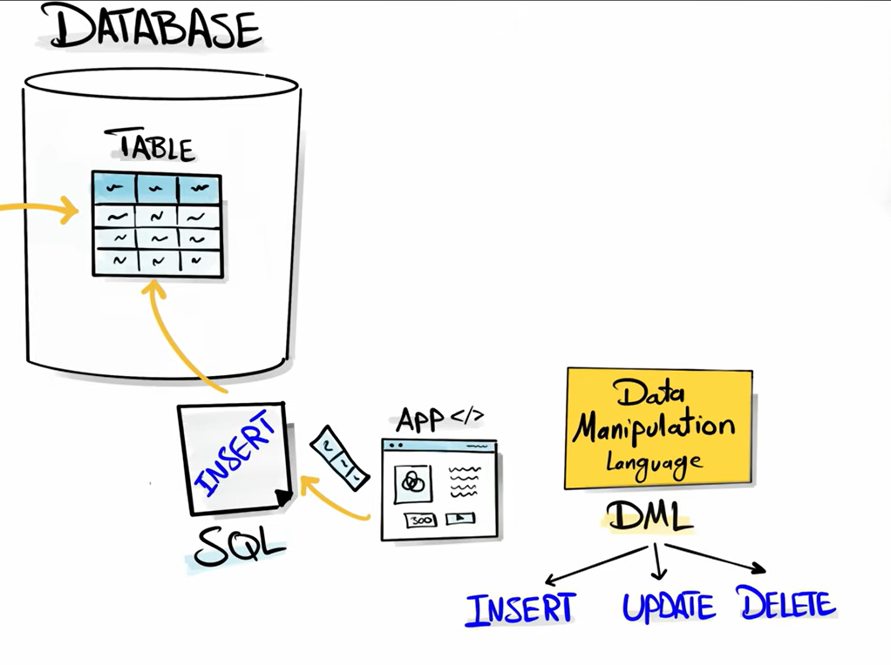
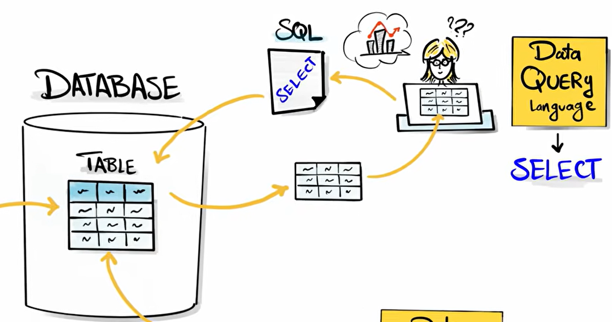

# **Types of SQL Commands**

SQL commands are grouped into categories based on their function in database management.

---

### **1. DDL – Data Definition Language**

Used to define and modify the database structure (schema).

**Commands:**

* **CREATE** → creates database objects (tables, views)
* **ALTER** → modifies structure
* **DROP** → deletes objects
* **TRUNCATE** → removes all records from a table

---

### **2. DML – Data Manipulation Language**

Used to modify the data stored in tables.

**Commands:**

* **INSERT** → adds new records
* **UPDATE** → modifies existing records
* **DELETE** → removes records

 
 
 

>[!NOTE]
> DELETE removes table data, while DROP removes the entire table including its structure.

---

### **3. DQL – Data Query Language**

Used to retrieve data from databases.

**Command:**

* **SELECT** → fetches data from tables

---

