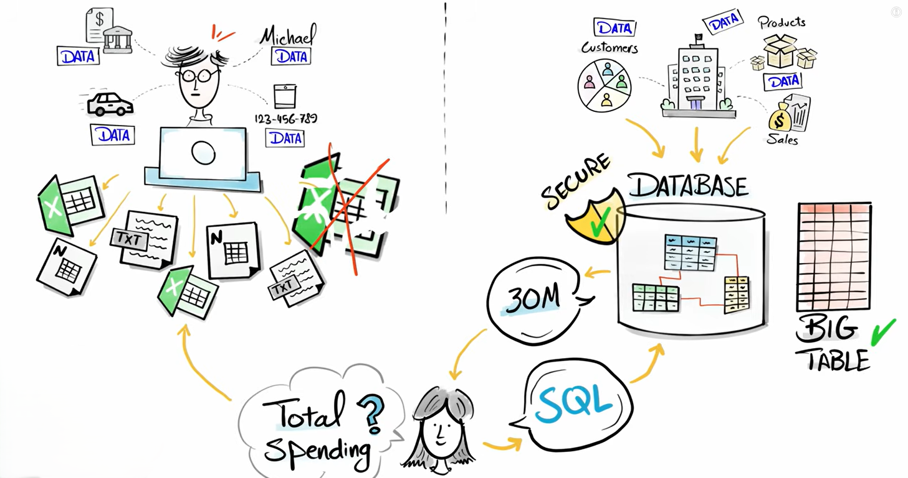
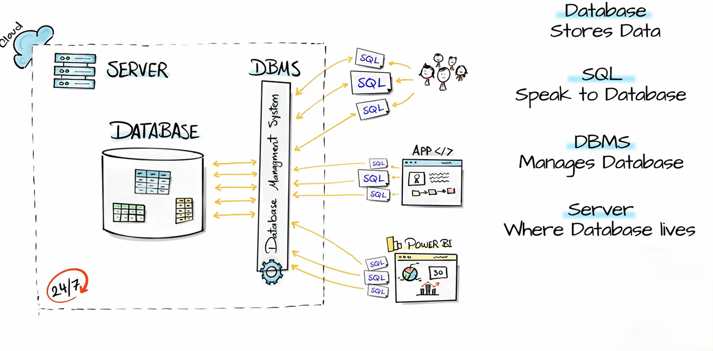

**SQL (Structured Query Language)** is a standard language used to **create, manage, and manipulate relational databases**. It allows users to store data in tables and perform operations such as inserting, updating, deleting, and retrieving data.

A **relational database** organizes data into tables consisting of rows (records) and columns (attributes). Relationships between tables are established using **primary keys** (unique identifiers) and **foreign keys** (references to other tables).

SQL is commonly used with database systems like MySQL, Oracle Database, and Microsoft SQL Server.

Overall, SQL provides an efficient way to manage structured data and is widely used in modern information systems.

 
 

---

## **DBMS (Database Management System)**

A **DBMS** is software that allows users to **create, store, manage, and retrieve data** from databases efficiently. It acts as an interface between users/applications and the database, handling data security, integrity, concurrency, and backup.

Examples of DBMS include MySQL, Oracle Database, and PostgreSQL.

**Functions of DBMS**

* Data storage and retrieval
* Data security and access control
* Backup and recovery
* Data integrity enforcement
* Concurrent access management

---

## **Database Server**

A **database server** is a computer system or software that **hosts and runs a DBMS** and provides database services to multiple clients over a network. It processes database requests (queries) and returns results.

Examples of database server software include Microsoft SQL Server, Oracle Database, and MySQL.

