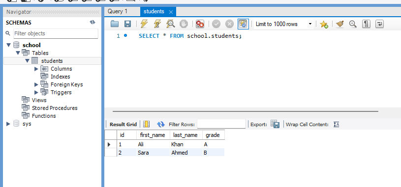

## **1. Create a Database**

A database is like a folder where tables are stored.

```sql
CREATE DATABASE school;
```

This creates a database named `school`.

To use it:

```sql
USE school;
```

---

## **2. Create a Table**

A table is like a spreadsheet with rows and columns.

```sql
CREATE TABLE students (
    id INT,
    first_name VARCHAR(50),
    last_name VARCHAR(50),
    grade CHAR(1)
);
```

* `id INT` → a column for numbers (like student ID).
* `first_name VARCHAR(50)` → a column for text, max 50 characters.
* `last_name VARCHAR(50)` → same for last name.
* `grade CHAR(1)` → a single character (like 'A', 'B', 'C').

---

## **3. Insert Data into Table**

```sql
INSERT INTO students (id, first_name, last_name, grade)
VALUES (1, 'Ali', 'Khan', 'A');

INSERT INTO students (id, first_name, last_name, grade)
VALUES (2, 'Sara', 'Ahmed', 'B');
```

Now the table has **2 rows**.

---




<br>
<br>

we have successfully createed an database


