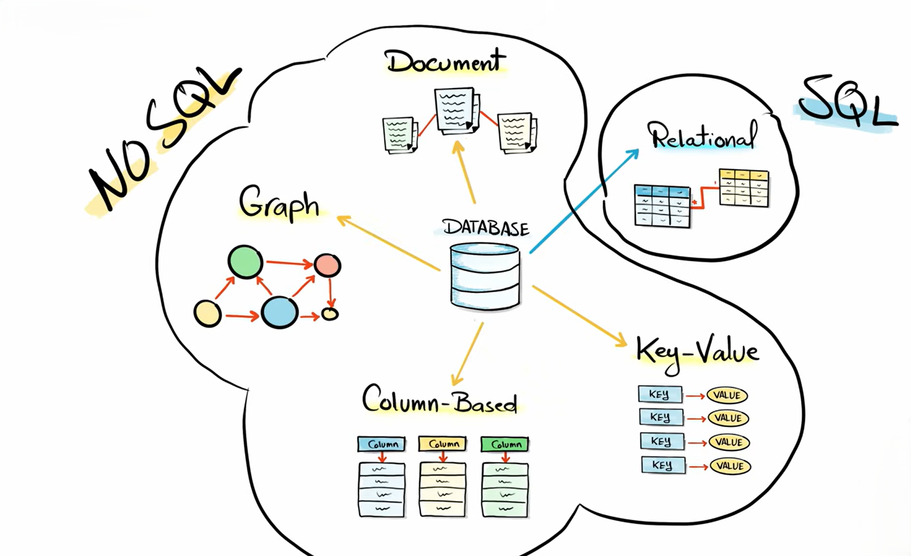
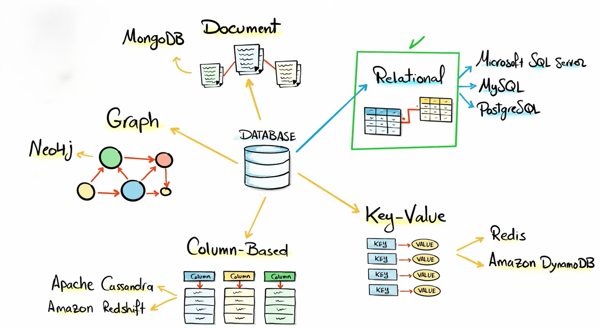

## SQL vs NoSQL

**SQL databases** are relational databases that store data in tables with fixed schemas and use Structured Query Language (SQL).

**NoSQL databases** are non-relational databases designed for flexible, scalable, and high-performance data storage. They can store data as documents, key-value pairs, graphs, or wide columns.

Examples:
SQL → MySQL, PostgreSQL
NoSQL → MongoDB, Cassandra

 
 
 

---

## Comparison Table

| Feature            | SQL                                 | NoSQL                                             |
| ------------------ | ----------------------------------- | ------------------------------------------------- |
| **Full Form**      | Structured Query Language           | Not Only SQL                                      |
| **Database Type**  | Relational                          | Non-relational                                    |
| **Structure**      | Tables (rows & columns)             | Documents, Key-Value, Graph, Column               |
| **Schema**         | Fixed schema                        | Flexible / Dynamic schema                         |
| **Scalability**    | Vertical scaling                    | Horizontal scaling                                |
| **Relationships**  | Strong relationships (Foreign Keys) | Limited or no direct relationships                |
| **Query Language** | Standard SQL                        | No fixed standard query language                  |
| **Best For**       | Structured data, complex queries    | Large-scale, unstructured or semi-structured data |

---

## When to Use

* Use **SQL** when data is structured and relationships are important (banking systems, university systems).
* Use **NoSQL** when handling big data, real-time apps, or flexible data formats (social media, IoT apps).

